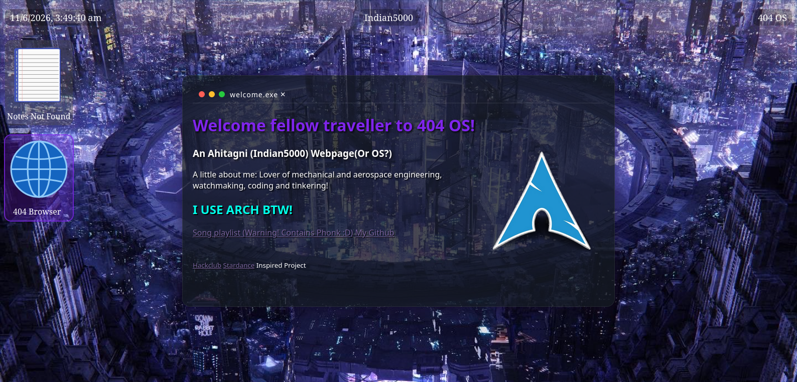
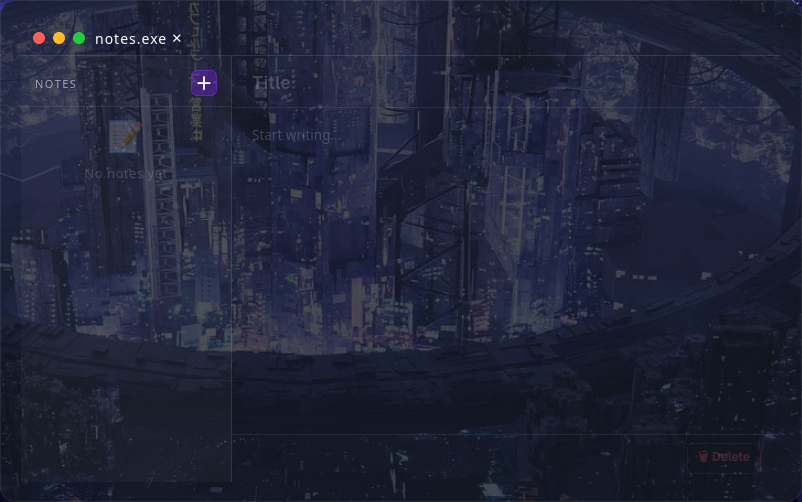
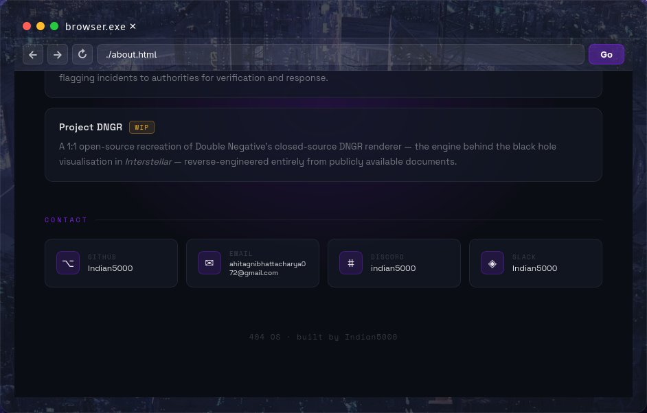

# 404 OS

A web-based desktop operating system built entirely in the browser. No frameworks, no dependencies — just HTML, CSS, and JavaScript.

---

## Screenshots


| Desktop | Notes App | Browser |
|--------|-----------|---------|
|  |  |  |

---

## Features

- **Draggable Windows** — All app windows can be freely repositioned across the desktop
- **Notes App** — Create, edit, and delete persistent notes, saved to `localStorage`
- **Browser App** — An in-OS browser window capable of loading internal pages and external URLs
- **About Page** — A built-in personal homepage served as the browser's default tab
- **Desktop Icons** — Clickable icons with select/deselect state that launch their respective apps
- **Live Clock** — Real-time clock and date displayed in the taskbar
- **Glassmorphism UI** — Frosted glass aesthetic with blur, transparency, and ambient glow throughout

---

## Tech Stack

| Layer | Technology |
|-------|------------|
| Markup | HTML5 |
| Styling | CSS3 (custom properties, backdrop-filter, flexbox/grid) |
| Logic | Vanilla JavaScript (ES6+) |
| Persistence | Browser `localStorage` |
| Fonts | Google Fonts — Space Grotesk, Space Mono |
| Hosting | GitHub Pages |

No build tools. No frameworks. No dependencies.

---

## Installation & Setup

**Live:** [https://indian5000.github.io/404OS/Frontend/index.html](https://indian5000.github.io/404OS/Frontend/index.html)

Or run locally:

```bash
# Clone the repository
git clone https://github.com/Indian5000/404OS.git
cd 404OS

# Serve locally (required for iframe support)
python -m http.server 5500
# or use the Live Server extension in VS Code
```

Then open `http://localhost:5500/Frontend/index.html` in your browser.

> **Note:** Opening `index.html` directly via `file://` will cause the browser app's iframe to render blank due to browser security restrictions. Always use a local server.

---

## Contributing

Contributions are welcome. To contribute:

1. Fork the repository
2. Create a new branch: `git checkout -b feature/your-feature-name`
3. Commit your changes: `git commit -m "Add: your feature"`
4. Push to your branch: `git push origin feature/your-feature-name`
5. Open a Pull Request

Please keep pull requests focused — one feature or fix per PR.

---

## AI Usage Declaration
 
Portions of this project were developed with the assistance of AI tools, specifically [Claude](https://claude.ai) by Anthropic. AI assistance was used for:
 
- Generating and debugging JavaScript logic
- Structuring and styling UI components
- Writing this README
All AI-generated code has been reviewed, tested, and integrated by the project author. The overall architecture, design direction, and creative decisions are the author's own.
 
---


## License

This project is licensed under the **MIT License**.

```
MIT License

Copyright (c) 2026 Indian5000

Permission is hereby granted, free of charge, to any person obtaining a copy
of this software and associated documentation files (the "Software"), to deal
in the Software without restriction, including without limitation the rights
to use, copy, modify, merge, publish, distribute, sublicense, and/or sell
copies of the Software, and to permit persons to whom the Software is
furnished to do so, subject to the following conditions:

The above copyright notice and this permission notice shall be included in all
copies or substantial portions of the Software.

THE SOFTWARE IS PROVIDED "AS IS", WITHOUT WARRANTY OF ANY KIND, EXPRESS OR
IMPLIED, INCLUDING BUT NOT LIMITED TO THE WARRANTIES OF MERCHANTABILITY,
FITNESS FOR A PARTICULAR PURPOSE AND NONINFRINGEMENT. IN NO EVENT SHALL THE
AUTHORS OR COPYRIGHT HOLDERS BE LIABLE FOR ANY CLAIM, DAMAGES OR OTHER
LIABILITY, WHETHER IN AN ACTION OF CONTRACT, TORT OR OTHERWISE, ARISING FROM,
OUT OF OR IN CONNECTION WITH THE SOFTWARE OR THE USE OR OTHER DEALINGS IN THE
SOFTWARE.
```

---

<p align="center">Built by <a href="https://github.com/Indian5000">Indian5000</a></p>